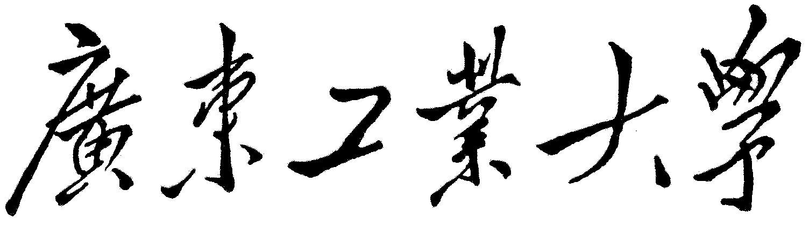
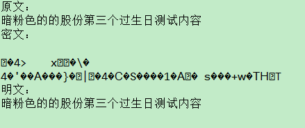
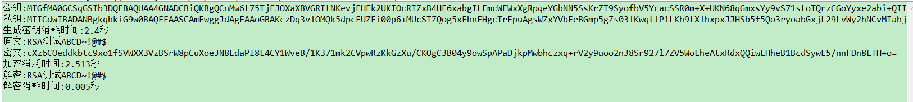
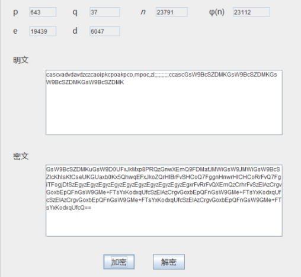

**课 程 实 验**

实验内容名称

DES算法

课程名称*\_ 密码学基础*

专业班级 *信安二班*

学 号 *3217005306*

学生姓名 *温丽容*

指导教师____\_*郝彦军* \_______\_

2019 年 11 月

1.1 实验目的
============

了解DES算法基本工作原理，体会并理解分组密码算法的混淆和扩散概念。了解Sbox工作原理及效果。了解DES的工作模式和填充方式。了解差分攻击的基本原理。

　DES算法为密码体制中的对称密码体制，又被称为美国数据加密标准。

　DES是一个分组加密算法，典型的DES以64位为分组对数据加密，加密和解密用的是同一个算法。

　密钥长64位，密钥事实上是56位参与DES运算（第8、16、24、32、40、48、56、64位是校验位，使得每个密钥都有奇数个1），分组后的明文组和56位的密钥按位替代或交换的方法形成密文组。

1.2 实验内容和要求
==================

编程实验DES算法

通过改变DES算法明文和密文内容观察加密后输出统计结果

实现生成指定差分的明文对，实现对特定差分输入的Sbox差分输出分布，观察 DES S-box
输入差分与密钥无关，输出差分与密钥相关特性。（选作）

实现 DES 各种工作模式和填充方式，实现使用DES算法对数据文件加解密（选作 P124）

实现简单的GUI界面

1.3 实验主要仪器设备和材料
==========================

计算机、网络环境、相关软件eclipse

1.4 实验方法、步骤及结果测试
============================

步骤

### 初始Ip置换

//

//初始Ip置换

private int[] IP={58,50,42,34,26,18,10,2,

60,52,44,36,28,20,12,4,

62,54,46,38,30,22,14,6,

64,56,48,40,32,24,16,8,

57,49,41,33,25,17,9,1,

59,51,43,35,27,19,11,3,

61,53,45,37,29,21,13,5,

63,55,47,39,31,23,15,7};

### 子密钥

/\*\*生成子密钥\*\*/

public void generateKeys(String key){

while (key.length()\<8){

key=key+key;

}

key=key.substring(0,8);

byte[] keys=key.getBytes();

int[] k_bit=new int[64];

}

### P置换

//P置换

private int[] P={16,7,20,21,29,12,28,17,

1,15,23,26,5,18,31,10,

2,8,24,14,32,27,3,9,

19,13,30,6,22,11,4,25};

### E扩展

private int[] E={32,1,2,3,4,5,

4,5,6,7,8,9,

8,9,10,11,12,13,

12,13,14,15,16,17,

16,17,18,19,20,21,

20,21,22,23,24,25,

24,25,26,27,28,29,

28,29,30,31,32,1};

### s盒替代

private static final int[][][] S_Box = {

{

{ 14, 4, 13, 1, 2, 15, 11, 8, 3, 10, 6, 12, 5, 9, 0, 7 },

{ 0, 15, 7, 4, 14, 2, 13, 1, 10, 6, 12, 11, 9, 5, 3, 8 },

{ 4, 1, 14, 8, 13, 6, 2, 11, 15, 12, 9, 7, 3, 10, 5, 0 },

{ 15, 12, 8, 2, 4, 9, 1, 7, 5, 11, 3, 14, 10, 0, 6, 13 } },

{

{ 15, 1, 8, 14, 6, 11, 3, 4, 9, 7, 2, 13, 12, 0, 5, 10 },

{ 3, 13, 4, 7, 15, 2, 8, 14, 12, 0, 1, 10, 6, 9, 11, 5 },

{ 0, 14, 7, 11, 10, 4, 13, 1, 5, 8, 12, 6, 9, 3, 2, 15 },

{ 13, 8, 10, 1, 3, 15, 4, 2, 11, 6, 7, 12, 0, 5, 14, 9 } },

{

{ 10, 0, 9, 14, 6, 3, 15, 5, 1, 13, 12, 7, 11, 4, 2, 8 },

{ 13, 7, 0, 9, 3, 4, 6, 10, 2, 8, 5, 14, 12, 11, 15, 1 },

{ 13, 6, 4, 9, 8, 15, 3, 0, 11, 1, 2, 12, 5, 10, 14, 7 },

{ 1, 10, 13, 0, 6, 9, 8, 7, 4, 15, 14, 3, 11, 5, 2, 12 } },

{

{ 7, 13, 14, 3, 0, 6, 9, 10, 1, 2, 8, 5, 11, 12, 4, 15 },

{ 13, 8, 11, 5, 6, 15, 0, 3, 4, 7, 2, 12, 1, 10, 14, 9 },

{ 10, 6, 9, 0, 12, 11, 7, 13, 15, 1, 3, 14, 5, 2, 8, 4 },

{ 3, 15, 0, 6, 10, 1, 13, 8, 9, 4, 5, 11, 12, 7, 2, 14 } },

{

{ 2, 12, 4, 1, 7, 10, 11, 6, 8, 5, 3, 15, 13, 0, 14, 9 },

{ 14, 11, 2, 12, 4, 7, 13, 1, 5, 0, 15, 10, 3, 9, 8, 6 },

{ 4, 2, 1, 11, 10, 13, 7, 8, 15, 9, 12, 5, 6, 3, 0, 14 },

{ 11, 8, 12, 7, 1, 14, 2, 13, 6, 15, 0, 9, 10, 4, 5, 3 } },

{

{ 12, 1, 10, 15, 9, 2, 6, 8, 0, 13, 3, 4, 14, 7, 5, 11 },

{ 10, 15, 4, 2, 7, 12, 9, 5, 6, 1, 13, 14, 0, 11, 3, 8 },

{ 9, 14, 15, 5, 2, 8, 12, 3, 7, 0, 4, 10, 1, 13, 11, 6 },

{ 4, 3, 2, 12, 9, 5, 15, 10, 11, 14, 1, 7, 6, 0, 8, 13 } },

{

{ 4, 11, 2, 14, 15, 0, 8, 13, 3, 12, 9, 7, 5, 10, 6, 1 },

{ 13, 0, 11, 7, 4, 9, 1, 10, 14, 3, 5, 12, 2, 15, 8, 6 },

{ 1, 4, 11, 13, 12, 3, 7, 14, 10, 15, 6, 8, 0, 5, 9, 2 },

{ 6, 11, 13, 8, 1, 4, 10, 7, 9, 5, 0, 15, 14, 2, 3, 12 } },

{

{ 13, 2, 8, 4, 6, 15, 11, 1, 10, 9, 3, 14, 5, 0, 12, 7 },

{ 1, 15, 13, 8, 10, 3, 7, 4, 12, 5, 6, 11, 0, 14, 9, 2 },

{ 7, 11, 4, 1, 9, 12, 14, 2, 0, 6, 10, 13, 15, 3, 5, 8 },

{ 2, 1, 14, 7, 4, 10, 8, 13, 15, 12, 9, 0, 3, 5, 6, 11 } }

};

### 16个子密钥

private int[][] sub_key=new int[16][48];

private String content;

private int p_origin_length;

public NewDes(String key,String content){

this.content=content;

p_origin_length=content.getBytes().length;

generateKeys(key);

}

### 拆分分组

/\*拆分分组\*/

public byte[] deal(byte[] p ,int flag){

origin_length=p.length;

int g_num;

int r_num;

g_num=origin_length/8;

r_num=8-(origin_length-g_num\*8);//8不填充

byte[] p_padding;

/\*\*\*\*填充\*\*\*\*\*\*\*\*/

if (r_num\<8){

p_padding=new byte[origin_length+r_num];

System.arraycopy(p,0,p_padding,0,origin_length);

for(int i=0;i\<r_num;i++){

p_padding[origin_length+i]=(byte)r_num;

}

}else{

p_padding=p;

}

g_num=p_padding.length/8;

byte[] f_p=new byte[8];

byte[] result_data=new byte[p_padding.length];

for(int i=0;i\<g_num;i++){

System.arraycopy(p_padding,i\*8,f_p,0,8);

System.arraycopy(descryUnit(f_p,sub_key,flag),0,result_data,i\*8,8);//加密

}

if (flag==0){//解密

byte[] p_result_data=new byte[p_origin_length];

System.arraycopy(result_data,0,p_result_data,0,p_origin_length);

return p_result_data;

}

return result_data;

}

###  加密

/\*\*加密\*\*/

public byte[] descryUnit(byte[] p,int k[][],int flag){

int[] p_bit=new int[64];

StringBuilder stringBuilder=new StringBuilder();

for(int i=0;i\<8;i++){

String p_b=Integer.toBinaryString(p[i]\&0xff);

while (p_b.length()%8!=0){

p_b="0"+p_b;

}

stringBuilder.append(p_b);

}

String p_str=stringBuilder.toString();

for(int i=0;i\<64;i++){

int p_t=Integer.valueOf(p_str.charAt(i));

if(p_t==48){

p_t=0;

}else if(p_t==49){

p_t=1;

}else{

System.out.println("To bit error!");

}

p_bit[i]=p_t;

}

return c_byte;

}

### 结果输出

**课 程 实 验**

实验内容名称

RSA算法

课程名称*\_ 密码学基础*

专业班级 *信安二班*

学 号 *3217005306*

学生姓名 *温丽容*

指导教师____\_*郝彦军* \_______\_

2019 年 11 月

1.1 实验目的
============

了解公钥算法基本原理和RSA算法的原理。了解RSA算法在数据加密和数字签名中的应用。了解RSA算法中大和数分解的困难性，从而理解单向函数的内涵。

RSA是目前最有影响力和最常用的公钥加密算法，它能够抵抗到目前为止已知的绝大多数密码攻击，已被ISO推荐为公钥数据加密标准。

RSA算法基于一个十分简单的数论事实：将两个大质数相乘十分容易，但是想要对其乘积进行因式分解却极其困难，因此可以将乘积公开作为加密密钥。

1.2 实验内容和要求
==================

1.  编程实现素数的选择判断

2.  编程实现模逆算法。

3.  编程实现快速模指运算。

4.  编程实现RSA算法。

5.  编程实现利用RSA进行数据加解密。

6.  实现利用RSA对较大数据进行加解密（选作）

7.  实现简单的GUI界面

1.3 实验主要仪器设备和材料
==========================

计算机、网络环境、相关软件eclipse

1.4 实验方法、步骤及结果测试

**Java RSA 加密工具类实现rsa**

/\*密钥长度\*/

**private final static int** *KEY_SIZE* = 1024;

/\*用于封装随机产生的公钥与私钥\*/

**private static** Map\<Integer, String\> *keyMap* = **new** HashMap\<Integer,
String\>();

/\*\*

\* 随机生成密钥对

\*/

**public static void** genKeyPair() **throws** NoSuchAlgorithmException {

// KeyPairGenerator类用于生成公钥和私钥对，基于RSA算法生成对象

KeyPairGenerator keyPairGen = KeyPairGenerator.*getInstance*("RSA");

// 初始化密钥对生成器

keyPairGen.initialize(*KEY_SIZE*, **new** SecureRandom());

// 生成一个密钥对，保存在keyPair中

KeyPair keyPair = keyPairGen.generateKeyPair();

// 得到私钥

RSAPrivateKey privateKey = (RSAPrivateKey) keyPair.getPrivate();

// 得到公钥

RSAPublicKey publicKey = (RSAPublicKey) keyPair.getPublic();

String publicKeyString =
Base64.*getEncoder*().encodeToString(publicKey.getEncoded());

// 得到私钥字符串

String privateKeyString =
Base64.*getEncoder*().encodeToString(privateKey.getEncoded());

// 将公钥和私钥保存到Map

//0表示公钥

*keyMap*.put(0, publicKeyString);

//1表示私钥

*keyMap*.put(1, privateKeyString);

}

**public static** String encrypt(String str, String publicKey) **throws**
Exception {

//base64编码的公钥

**byte**[] decoded = Base64.*getDecoder*().decode(publicKey);

RSAPublicKey pubKey = (RSAPublicKey)
KeyFactory.*getInstance*("RSA").generatePublic(**new**
X509EncodedKeySpec(decoded));

//RSA加密

Cipher cipher = Cipher.*getInstance*("RSA");

cipher.init(Cipher.*ENCRYPT_MODE*, pubKey);

String outStr =
Base64.*getEncoder*().encodeToString(cipher.doFinal(str.getBytes("UTF-8")));

**return** outStr;

}

**public static** String decrypt(String str, String privateKey) **throws**
Exception {

//64位解码加密后的字符串

**byte**[] inputByte = Base64.*getDecoder*().decode(str);

//base64编码的私钥

**byte**[] decoded = Base64.*getDecoder*().decode(privateKey);

RSAPrivateKey priKey = (RSAPrivateKey)
KeyFactory.*getInstance*("RSA").generatePrivate(**new**
PKCS8EncodedKeySpec(decoded));

//RSA解密

Cipher cipher = Cipher.*getInstance*("RSA");

cipher.init(Cipher.*DECRYPT_MODE*, priKey);

String outStr = **new** String(cipher.doFinal(inputByte));

**return** outStr;

}

**public static void** main(String[] args) **throws** Exception {

**long** temp = System.*currentTimeMillis*();

//生成公钥和私钥

*genKeyPair*();

//加密字符串

//打印公钥

System.*out*.println("公钥:" + *keyMap*.get(0));

//打印私钥

System.*out*.println("私钥:" + *keyMap*.get(1));

//打印生成密钥所需时间

System.*out*.println("生成密钥消耗时间:" + (System.*currentTimeMillis*() - temp)
/ 1000.0 + "秒");

//原文

String message = "RSA测试ABCD\~!\@\#\$";

System.*out*.println("原文:" + message);

temp = System.*currentTimeMillis*();

//定义密文变量

String messageEn = *encrypt*(message, *keyMap*.get(0));

System.*out*.println("密文:" + messageEn);

//打印加密所需时间

System.*out*.println("加密消耗时间:" + (System.*currentTimeMillis*() - temp) /
1000.0 + "秒");

temp = System.*currentTimeMillis*();

String messageDe = *decrypt*(messageEn, *keyMap*.get(1));

System.*out*.println("解密:" + messageDe);

System.*out*.println("解密消耗时间:" + (System.*currentTimeMillis*() - temp) /
1000.0 + "秒");

}

**结果**

**RSA算法详细实现**

随机生成一个可能是素数的数

**public static long** probablePrime(**int** range, **int** rounds) {

**if** (range \> 0 && rounds \> 0) {

ThreadLocalRandom random = ThreadLocalRandom.*current*();

**while** (**true**) {

**int** num = random.nextInt(range) + 2;

// 进行rounds轮素性测试

**if** (PrimalityTester.*isProbablePrime*(num, rounds))

**return** num;

}

}

**return** -1;

}

最大公约数

**public static long** gcd(**long** m, **long** n) {

**while**(**true**){

**if** ((m = m % n) == 0)

**return** n;

**if** ((n = n % m) == 0)

**return** m;

}

}

扩展欧几里得

**private static long** extendedEuclid(**long** a, **long** b) {

**long** x = 0, y = 1, lastX = 1, lastY = 0, temp;

**if** (a \< b) {

temp = a;

a = b;

b = temp;

}

**while** (b != 0) {

**long** q = a / b, r = a % b;

a = b;

b = r;

temp = x;

x = lastX - q \* x;

lastX = temp;

temp = y;

y = lastY - q \* y;

lastY = temp;

}

**return** lastY;

}

模幂运算

**public static int** exp(**int** x, **int** b, **int** n) {

**if** (b == 1) {

**return** x % n;

}

**if** ((b & 1) == 1) { // b是奇数

**return** ((x % n) \* *exp*(x, b - 1, n) % n);

}

// b是偶数

**long** ans = *exp*(x, b / 2, n);

**return** (**int**) (ans \* ans) % n;

}

/\*\* Function to calculate (a \^ b) % c \*\*/

**public static long** modExpNonRec(**long** a, **long** b, **long** c) {

**long** res = 1;

**for** (**int** i = 0; i \< b; i++) {

res \*= a;

res %= c;

}

**return** res % c;

}

判断一个数是否素数，使用米勒-拉宾素性测试

public static boolean isProbablePrime(long n, int rounds) {

// 2是素数

if (n == 2)

return true;

// n为偶数

if ((n & 1) == 0)

return false;

// 把n-1写成(2\^s)\*d的形式

long s = 0, d = n - 1, quotient, remainder;

for (;;) {

quotient = d / 2;

remainder = d % 2;

if (remainder == 1)

break;

s++;

d = quotient;

}

Random rnd = ThreadLocalRandom.current();

// 进行k次米勒-拉宾测试

for (int i = 0; i \< rounds; i++) {

// n肯定是合数，结束，不然n可能是素数，继续测试

long a = Math.abs(rnd.nextLong()) % (n - 1) + 1;

long b = MathUtil.modExpNonRec(a, d , n);

if (b == 1 \|\| b == n - 1) {

continue;

}

int j = 0;

for (; j \< s; j++) {

b = MathUtil.modExpNonRec(b, 2, n);

if (b == 1) {

return false;

}

if (b == n - 1)

break;

}

if (j == s) // None of the steps mad x equals n-1.

return false;

}

return true;

}

}

加密解密

/\*\*

\* 加密函数，当数值*val*超过2 \<\< 16时，将*val*转换为char类型会发生溢出问题

\* 所以将模逆结果值分割成两个字符表示,在解密时再进行还原

\* **\@param** plaintext 明文

\* **\@return** 密文

\*/

**public** String encrypt(String plaintext) {

**int**[] plaintextBytes = changeToInts(plaintext.toCharArray());

StringBuilder builder = **new** StringBuilder();

**for** (**int** plaintextByte : plaintextBytes) {

**int** modExpResult = (**int**) MathUtil.*modExpNonRec*(plaintextByte, e, n);

builder.append((**char**) (modExpResult / *SPLIT_POINT*)).

append((**char**) (modExpResult % *SPLIT_POINT*));

}

**return** *encoder*.encodeToString(builder.toString().getBytes());

}

/\*\*

\* 解密函数

\* **\@param** cipher 密文

\* **\@return** 明文

\*/

**public** String decrypt(String cipher) {

// 获取解码后的字符串的字符数组

**char**[] cipherChars = **new** String(*decoder*.decode(cipher)).toCharArray();

// 将相邻两个字符合并，用一个整型数表示，得到原加密结果数组

**int**[] cipherInts = **new int**[cipherChars.length / 2];

**for**(**int** i = 0; i \< cipherInts.length; i++)

cipherInts[i] = (**int**)cipherChars[i \* 2] \* *SPLIT_POINT*

\+ (**int**)cipherChars[i \* 2 + 1];

// 解密

**int**[] plaintextInts = **new int**[cipherInts.length];

**for**(**int** i = 0; i \< cipherInts.length; i++)

plaintextInts[i] = (**int**)MathUtil.*modExpNonRec*(cipherInts[i], d, n);

StringBuilder plainText = **new** StringBuilder();

**for** (**int** plaintextInt : plaintextInts)

plainText.append((**char**) plaintextInt);

**return** plainText.toString();

}

/\*\*

\* 考虑到Java的字符编码问题和扩展性，将字符数组转化为*int*数组

\* 而不用字节表示

\* **\@param** chars 字符数组

\* **\@return** *int*数组

\*/

**private int**[] changeToInts(**char**[] chars) {

**if** (chars != **null** && chars.length \> 0) {

**int**[] result = **new int**[chars.length];

**for** (**int** i = 0; i \< chars.length; i++) {

result[i] = chars[i];

}

**return** result;

}

**return null**;

}

结果

